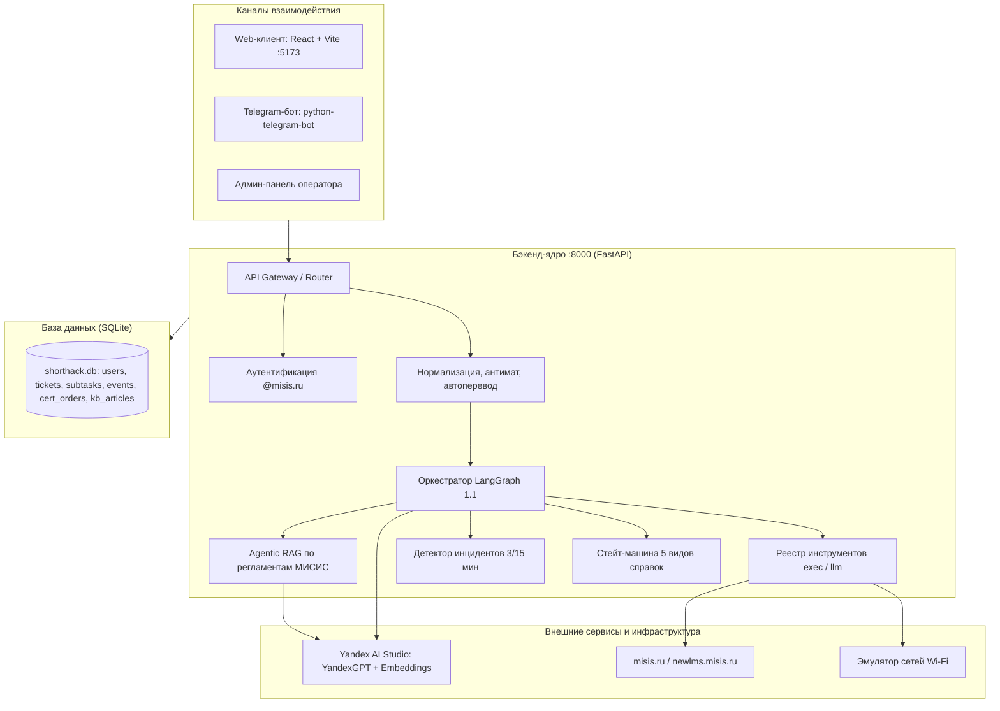

# Интерактивная карта проекта: ИИ-помощник МИСИС

> Полное детальное описание по Spec-Kit находится в [`.foryou/PROJECT_SPEC.md`](PROJECT_SPEC.md).  
> Интерактивный HTML-дашборд с Mermaid и питчем: [`overview.html`](../overview.html).

---

## 1. Структура системы и связи модулей

---

## 2. Фичи проекта (Spec-Kit)

| Код фичи | Название | Статус | Документация |
|---|---|---|---|
| **001** | **Core (Ядро ассистента)** | Спека утверждена, чеклист 100% | [`specs/001-misis-support-assistant/`](../specs/001-misis-support-assistant/) |
| **002** | **Web Interface (Веб-клиент & Админка)** | Спека утверждена, чеклист 100% | [`specs/002-web-interface/`](../specs/002-web-interface/) |
| **003** | **Telegram Bot (Омниканальный бот)** | Спека утверждена, чеклист 100% | [`specs/003-telegram-bot/`](../specs/003-telegram-bot/) |

---

## 3. Ключевые возможности

1. **Реальная диагностика инфраструктуры:** HTTP-проверки сайтов и эмуляция Wi-Fi.
2. **Мгновенные извещения о сбоях:** шаблон за ≤ 2 секунды без вызова LLM.
3. **Agentic RAG без галлюцинаций:** ответы строго по регламентам с цитированием.
4. **Заказ 5 типов справок:** сквозной трекинг 4 статусов от подачи до выдачи.
5. **Детектор массовых инцидентов:** 3 жалобы за 15 минут → экстренный пуш дежурному в Telegram + массовый ответ.
6. **Самообучение базы знаний:** оператор закрывает заявку → генерация черновика статьи в 1 клик.
