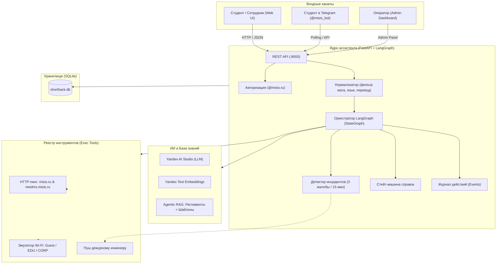
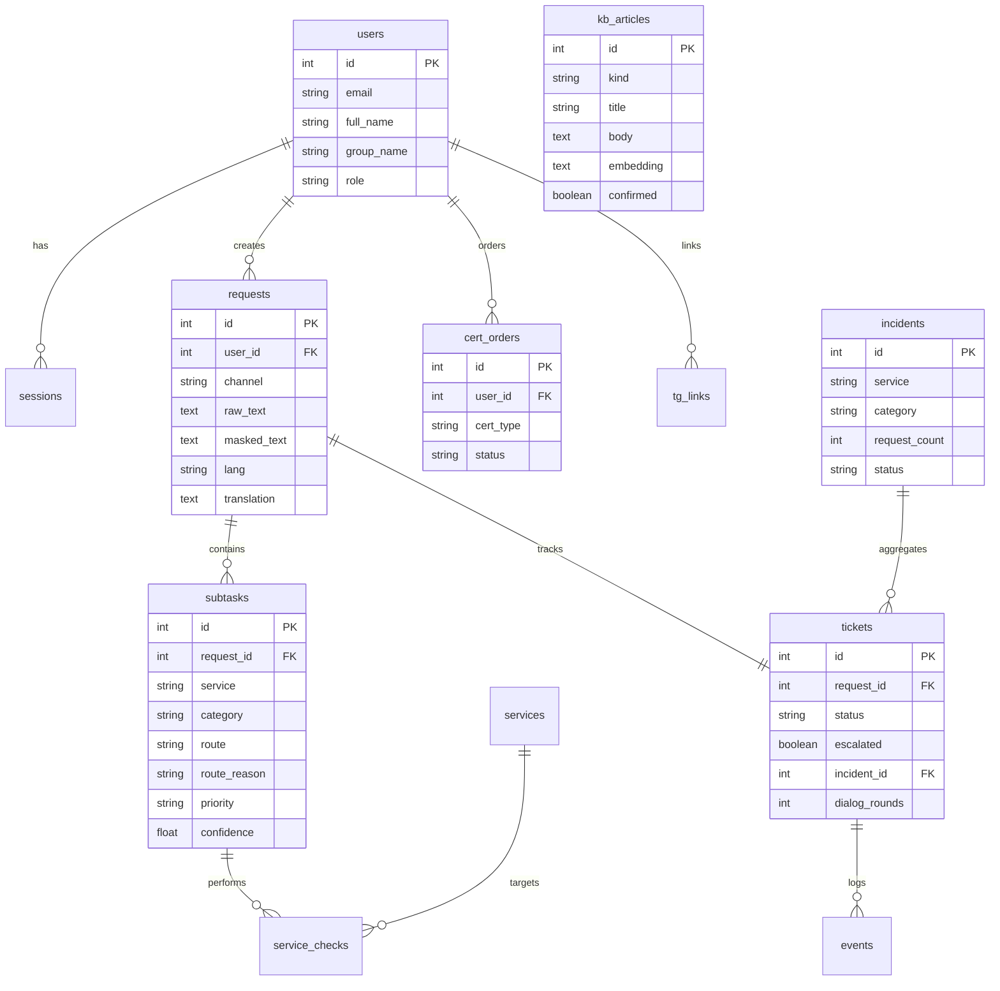

# Полная спецификация проекта: ИИ-помощник технической поддержки НИТУ МИСИС

> Документ составлен по стандарту **Spec-Kit** на базе согласованных спецификаций ядра (001), веб-интерфейса (002) и Telegram-бота (003).

---

## 1. Общие сведения о проекте

- **Название:** ИИ-помощник технической поддержки НИТУ МИСИС (MISIS Support Assistant)
- **Контекст:** Разработка для хакатона МИСИС — интеллектуальная первая линия поддержки студентов и сотрудников
- **Стек:** 
  - **Backend (Ядро):** Python 3.12, FastAPI, LangGraph 1.1 (StateGraph), SQLAlchemy 2.0, SQLite, Pydantic v2, httpx
  - **AI / LLM:** Yandex AI Studio (YandexGPT Pro/Lite, Text Embeddings), Agentic RAG без внешних векторных БД (косинусное сходство на Python)
  - **Frontend:** React 18, Vite 5, чистый CSS / Dark Theme
  - **Боты / Каналы:** Telegram Bot (long-polling)
  - **Тестирование:** pytest, httpx TestClient

---

## 2. Проблематика и ценность продукта

### Проблема
В пиковые периоды (начало семестра, сессия, аварии сети) служба поддержки университета сталкивается с:
1. **Лавиной однотипных обращений:** «Не могу войти в Moodle», «Как получить справку в военкомат?», «Где взять пароль от Wi-Fi?».
2. **Паникой при авариях:** при сбое корпоративного Wi-Fi или личного кабинета поддержка получает сотни одинаковых сообщений, блокирующих телефонные линии и чаты.
3. **Медленной обработкой справок:** ручная проверка статуса студента, ручное внесение в журналы.
4. **Ошибками классических LLM-ботов:** обычные боты галлюцинируют, не знают статуса сервисов МИСИС и раздражают пользователей.

### Решение
Автономный агент-инженер первой линии, который:
- **Действует, а не только пишет:** сам пингует университетские сайты и проверяет Wi-Fi.
- **Мгновенно гасит аварии:** при подтверждённом сбое отдаёт системный шаблон за **≤ 2 секунды** без затрат на LLM.
- **Детектирует массовые сбои:** 3 однотипные жалобы за 15 минут активируют инцидент, шлют экстренный пуш дежурному в Telegram и позволяют отправить массовый ответ в 1 клик.
- **Оформляет 5 видов справок:** связка с профилем студента и сквозной жизненный цикл из 4 статусов.
- **Самообучается:** закрытое оператором обращение в 1 клик трансформируется в новую статью базы знаний.

---

## 3. Архитектура системы

---

## 4. Спецификация модулей и фич

### Фича 001: Ядро ассистента (Core)

#### 1. Приём и нормализация
- **FR-001 (Идентификация):** обращение принимается только от авторизованного пользователя с привязкой к профилю (ФИО, группа, почта).
- **FR-002 (Антимат):** ненормативная лексика автоматически маскируется звёздочками (`*`), исходный текст сохраняется для оператора с предупреждением.
- **FR-003 (Языки и перевод):** автоопределение языка обращения; если язык не русский — формируется перевод для оператора.
- **FR-004 (Сплиттер):** составные обращения разбиваются на атомарные подзадачи с независимой маршрутизацией.

#### 2. Маршрутизация и Safe-Route
- **FR-010 (Классификация):** каждая подзадача направляется по одному из 4 маршрутов:
  1. `auto_check` — автоматическая диагностика сервиса;
  2. `kb` — RAG-поиск в базе знаний;
  3. `cert_order` — заказ справки;
  4. `escalate` — прямая передача оператору.
- **FR-011 (Приоритеты):** арбитраж приоритетов (`critical`, `high`, `medium`, `low`). Правила могут только повышать приоритет (подтверждённый сбой → всегда `critical`).
- **FR-012 (Обоснование):** система фиксирует текстовое объяснение выбора маршрута («почему так решено»).
- **FR-013 (Safe Route):** при недоступности модели, срабатывании триггеров или если уверенность классификатора `< 0.6` — автоматическая безопасная эскалация оператору (ноль выдуманных ответов).
- **FR-014 (Дедупликация):** повторное обращение по той же теме `(сервис + категория)` привязывается к открытой заявке.

#### 3. Реестр инструментов (Tools) и автодиагностика
- **FR-020 (Реестр):** инструменты делятся на `exec` (без участия LLM) и `llm` (с участием модели). Лимит — не более 3 вызовов на обращение.
- **FR-022..024 (Диагностика):**
  - Реальная проверка доступности `https://misis.ru` (HTTP 2xx/3xx ≤ 5 сек);
  - Реальная проверка доступности `https://newlms.misis.ru`;
  - Эмулируемые статусы Wi-Fi сетей: `MISIS-Guest`, `MISIS-EDU`, `MISIS-CORP` с ручным переключением через админку.
- **FR-025 (Уточняющий диалог):** если сервисы в норме — шаблонный уточняющий вопрос (не более 2 раундов). Молчание пользователя оставляет заявку в статусе ожидания без штрафной эскалации.
- **FR-026 (Мгновенное извещение):** если сервис в состоянии «down» — шаблонное извещение за **≤ 2 секунды** без вызова LLM.

#### 4. База знаний (Agentic RAG)
- **FR-030 (Состав базы):** регламенты (пароли, Wi-Fi, LMS, заказ справок, регламент поддержки) + шаблоны ответов.
- **FR-031 (Цитаты и точность):** строгая генерация по найденным источникам с цитированием.
- **FR-032 (Zero-Hallucination):** пустая выдача поиска → 100% эскалация человеку.

#### 5. Каталог и заказ справок
- **FR-041 (5 типов справок):**
  1. Справка о выплатах;
  2. Справка-вызов (для работодателя на сессию);
  3. Справка для переболевших / медотвода / вакцинации;
  4. Справка с места учёбы (электронная с ЭЦП);
  5. Справка в военкомат (приложение №4).
- **FR-042 (Статусная модель заказа):**
  `не обработана` → `обрабатывается` → `готова и ждёт выдачи` → `забрана`.

#### 6. Детектор массовых сбоев
- **FR-050 (Детекция аварий):** ≥ 3 однотипных обращений `(сервис + категория)` за скользящее окно 15 минут → создание **Инцидента**.
- **FR-051 (Тревога дежурному):** экстренное уведомление в Telegram дежурному инженеру и красный баннер в админке (≤ 1 мин).
- **FR-052 (Привязка дублей):** новые однотипные жалобы при активном инциденте сразу получают извещение и привязываются к инциденту без спама дежурному.
- **FR-053 (Массовый ответ):** оператор одной кнопкой рассылает готовый ответ всем затронутым студентам.

#### 7. Поддержка оператора и самообучение
- **FR-060 (Карточка эскалации):** готовое саммари сути, результаты проверок, рекомендуемое решение, перевод (понимание ≤ 30 сек).
- **FR-061 (Аудит):** подробный журнал событий (`events`) по каждому действию системы.
- **FR-063 (Замкнутый цикл):** при закрытии эскалации оператор может нажать «В базу знаний» — LLM генерирует черновик статьи, после утверждения он индексируется в RAG.

---

### Фича 002: Веб-интерфейс (Web UI)

- **Экран входа:** эмуляция SSO по корпоративной почте (`@misis.ru`, `@edu.misis.ru`), отображение ФИО и группы.
- **Форма подачи:** приём текста письма или расшифровки звонка, бейджи быстрого выбора демо-примеров (сбой Wi-Fi, неполное письмо, заказ справки, мат/английский).
- **Интерактивный диалог:** отображение вердикта агента, обоснование маршрута, цепочка уточнений в том же окне.
- **Личный кабинет студента:**
  - Список моих обращений и текущие статусы;
  - Каталог справок с описанием и кнопкой моментального заказа;
  - Трекер статусов заказанных справок.
- **Админка оператора:**
  - Очередь тикетов с сортировкой по приоритетам (`critical` → `low`);
  - Карточка эскалации с саммари и журналом действий;
  - Статус-борд сервисов (сайт, LMS, 3 сети Wi-Fi);
  - Раздел управления заказами справок (смена статусов по цепочке);
  - **Тест-панель (демо-пульт):** кнопки вызова инструментов, переключатели аварий Wi-Fi, кнопка «Сгенерировать волну из 3 жалоб»;
  - Виджет аналитики (доля автозакрытия, среднее время первой реакции, число инцидентов).

---

### Фича 003: Telegram-бот (Bot)

- **Омниканальность:** полнофункциональный чат с пользователем через long-polling.
- **Привязка аккаунта:** команда `/start` запрашивает email МИСИС, подтверждает привязку и синхронизирует профиль с вебом («по мне была инфа»).
- **Команды:**
  - `/status` — статус моих открытых обращений;
  - `/certs` — каталог, заказ справок и просмотр их готовности;
  - `/help` — подсказка по возможностям.
- **Уведомления дежурному:** автоматический пуш в рабочий чат дежурного при объявлении инцидента или создании критической эскалации.

---

## 5. Модель данных (Схема сущностей)

### Стейт-машины статусов

1. **Заявка (Ticket):**
   `новая` ➔ `в работе` ➔ `ждёт ответа пользователя` ➔ `решена` ➔ `закрыта`
   *(эскалация оператору является булевым признаком `escalated: true`, а не статусом).*

2. **Заказ справки (Cert Order):**
   `не обработана` ➔ `обрабатывается` ➔ `готова и ждёт выдачи` ➔ `забрана`
   *(переход возможен только строго вперёд).*

3. **Инцидент (Incident):**
   `active` ➔ `resolved`

---

## 6. Метрики и измеримые критерии успеха (Success Criteria)

| ID | Метрика / Критерий | Целевой порог | Как проверяется |
|---|---|---|---|
| **SC-001** | Первая реакция на обращение | **≤ 60 секунд** | Замер от отправки до первого ответа/уточнения |
| **SC-002** | Точность маршрутизации демо-набора | **≥ 90%** | Прогон 10 контрольных кейсов |
| **SC-003** | Понимание ситуации оператором | **≤ 30 секунд** | Карточка эскалации с саммари и рекомендацией |
| **SC-004** | Извещение о подтверждённом сбое | **≤ 2 секунды** | Ответ системным шаблоном без обращения к LLM |
| **SC-005** | Реакция на массовый инцидент | **≤ 1 минута** | Детекция 3 жалоб за 15 мин + пуш дежурному |
| **SC-006** | Достоверность RAG (Zero-Hallucination) | **100% / 0 выдумок** | При отсутствии факта в базе — строгая эскалация |
| **SC-007** | Сквозное оформление справки | **≤ 60 секунд** | Запрос → регламент → создание заказа в ЛК |
| **SC-008** | Полный цикл живого демо на сцене | **≤ 2 минуты** | Прогон сценария «вход → обращение → админка» |

---

## 7. Справочник REST API (Ядро)

| Метод | Путь | Описание | Доступ |
|---|---|---|---|
| `POST` | `/api/auth/login` | Эмуляция входа по почте `@misis.ru` | Публичный |
| `POST` | `/api/auth/logout` | Сброс cookie-сессии | Авторизованный |
| `GET` | `/api/auth/me` | Профиль текущего пользователя | Авторизованный |
| `POST` | `/api/requests` | Подача обращения (запуск LangGraph) | Авторизованный |
| `POST` | `/api/requests/{id}/reply` | Ответ на уточняющий вопрос (раунд ≤ 2) | Автор обращения |
| `GET` | `/api/requests` | Мои обращения со статусами | Авторизованный |
| `GET` | `/api/certs/catalog` | Каталог 5 типов справок | Авторизованный |
| `POST` | `/api/certs/orders` | Заказ справки с автоподстановкой профиля | Авторизованный |
| `GET` | `/api/certs/orders` | Мои заказы справок | Авторизованный |
| `GET` | `/api/admin/queue` | Очередь обращений оператора | Оператор |
| `GET` | `/api/admin/escalations/{id}` | Карточка эскалации (саммари, журнал) | Оператор |
| `POST` | `/api/admin/escalations/{id}/close` | Закрытие + генерация статьи БЗ | Оператор |
| `POST` | `/api/admin/kb/articles/{id}/confirm` | Подтверждение черновика и индексация | Оператор |
| `GET` | `/api/admin/certs/orders` | Управление всеми заказами справок | Оператор |
| `PATCH`| `/api/admin/certs/orders/{id}` | Продвижение статуса справки | Оператор |
| `GET` | `/api/admin/status-board` | Статус-борд сервисов (сайт, LMS, Wi-Fi) | Оператор |
| `PATCH`| `/api/admin/services/{id}` | Ручное переключение Wi-Fi (up / down) | Оператор |
| `POST` | `/api/admin/tools/{name}/invoke` | Вызов инструмента / «Волна из 3 жалоб» | Оператор |
| `GET` | `/api/admin/incidents` | Список инцидентов | Оператор |
| `POST` | `/api/admin/incidents/{id}/broadcast` | Массовая рассылка ответа затронутым | Оператор |
| `GET` | `/api/admin/metrics` | Метрики для дашборда и питча | Оператор |
| `GET` | `/api/health` | Проверка живости сервера и связи с LLM | Публичный |

---

## 8. Демо-сценарий для питча (Ready-to-Show)

1. **Кейс 1 (Быстрый сбой):** Вбиваем: *«Упал Wi-Fi MISIS-EDU»* при аварийном статусе сети. Система за **2 секунды** отдаёт шаблон без LLM: *«Сбой известен, чиним»*.
2. **Кейс 2 (Массовая авария):** Нажимаем в тест-панели админки *«Волна жалоб»*. Через секунду загорается красный баннер инцидента, дежурному уходит пуш в Telegram, а оператор жмёт *«Уведомить всех затронутых»*.
3. **Кейс 3 (Справка):** Студент пишет: *«Мне нужна справка в военкомат»*. Агент находит регламент, оформляет заказ со статусом *«не обработана»*, данные подставляются из профиля. В админке оператор меняет статус на *«готова»* — студент видит обновление.
4. **Кейс 4 (Замкнутый цикл):** Сложный запрос на английском с матом эскалируется оператору. Оператор видит готовое саммари и перевод, решает тикет и нажимает *«В базу знаний»*. Агент сразу индексирует ответ и далее отвечает на него сам.
